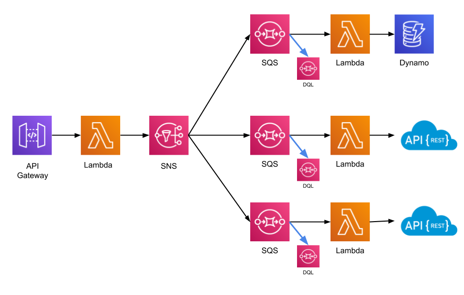

# EVENTOS Y PROCESOS ASÍNCRONOS



Este servicio esta desarrollado en AWS y serverless framework  

Para deployar el proyecto
1. Poner las credenciales de aws en la linea 9 y 10 del archivo Makefile
2. Generar las imagenes docker
   ```
    make install
   ```
3. deployar
   ```
    make sls-deploy
   ```

despues de estos pasos se va a generar toda la infraestructura para que funcione el servicio

La primera fila, captura todos los eventos que fueron ejecutados y los guarda dentro de un dynamo

la segunda y tercera fila son proyectos que estan suscritas a eventos en especifico, se llama a una url para procesar el evento

Para usarlo tienes 2 formas
1. llamas mediante un POST a la url del API GATEWAY pasando los datos del evento
2. LLamas directamnete al SNS pasando los datos estandarizados del evento, para esto tu aplicacion debe tener los permisos para publicar en el SNS